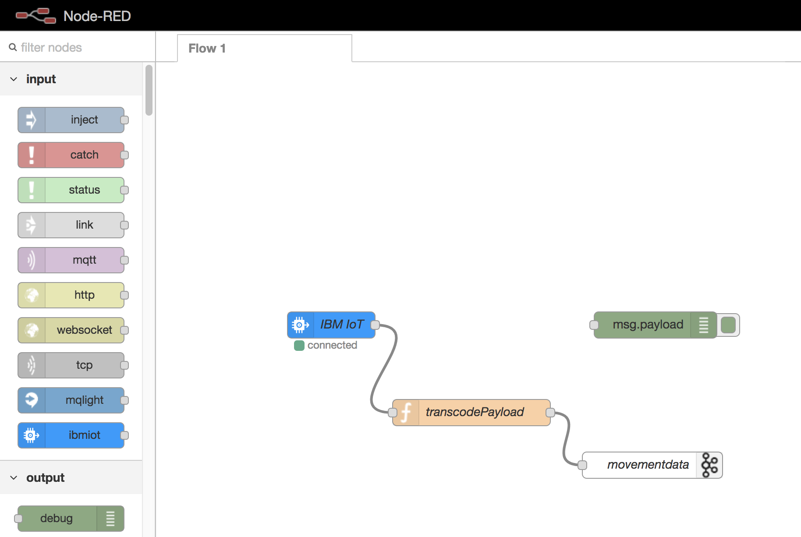
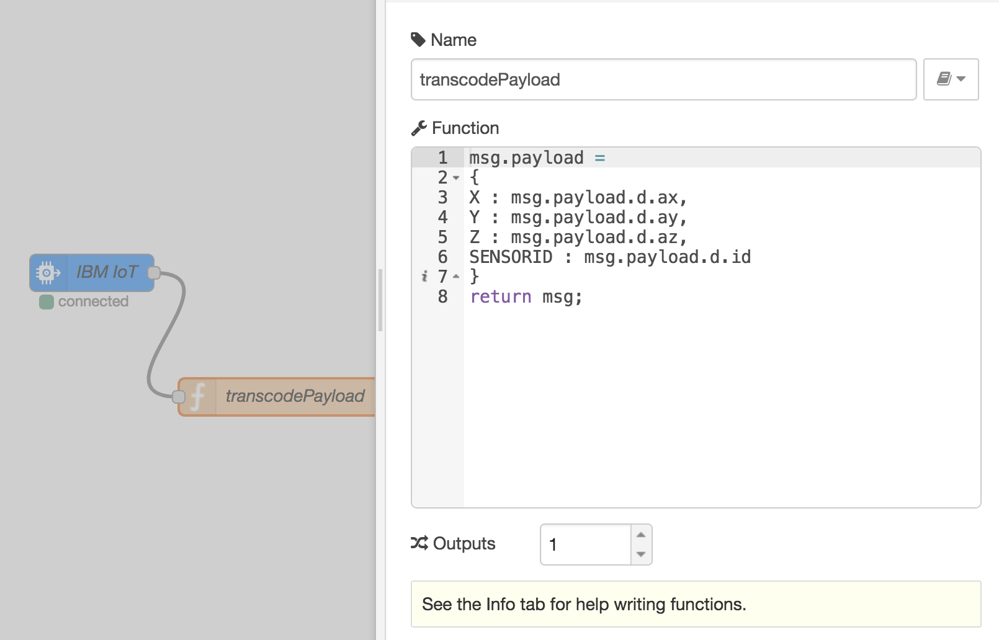
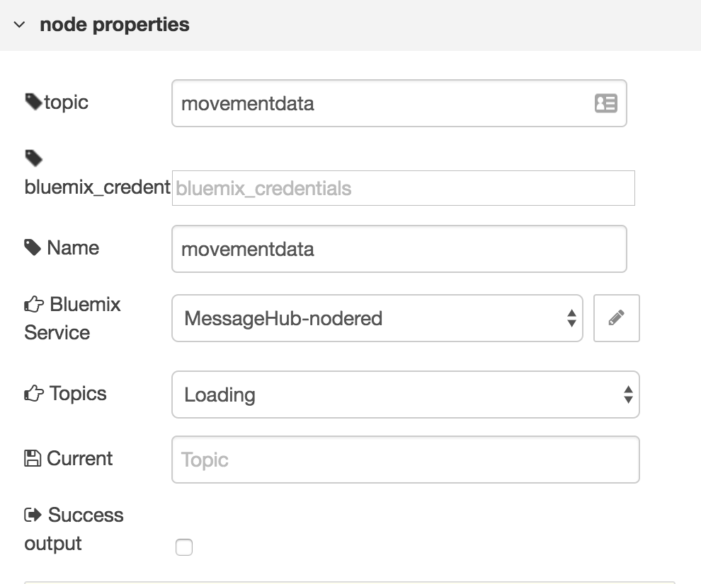
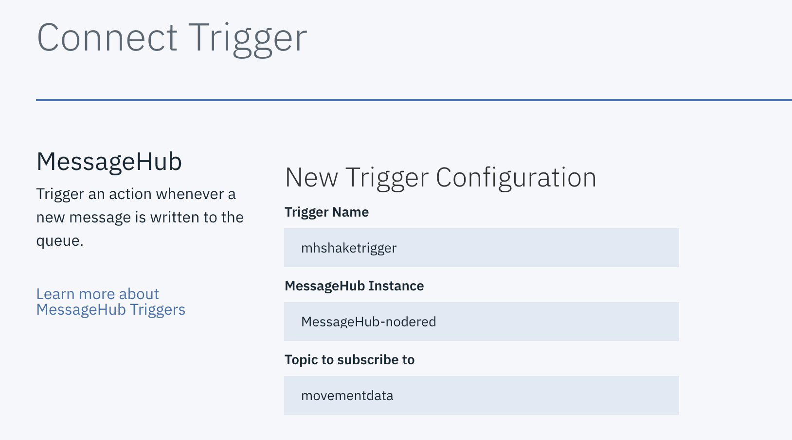

# IBM Cloud IoT and Serverless Demo

This demo was first used at [VoxxedDays Athens 2018](https://voxxeddays.com/athens/containers-grow-up-use-cases-in-serverless-iot/) for a demonstration of
various IBM Cloud compute and service capabilities which use container-based
execution models for the serverless and IoT space.

The first section of IoT-related steps are exactly the same as the demo created by fellow IBMer Romeo Kienzler in [this article](https://www.ibm.com/developerworks/library/iot-simple-iot-accelerometer-game/index.html). If you have trouble with my instructions you may want to view that in-depth article for more details.

To recreate this demo a set of capabilities and services will be created in
IBM Cloud. Generally the following items will be necessary:

- An [IBM Cloud](https://www.ibm.com/cloud/) account (free tier services can be used for all steps)
- A [Cloudant database](https://console.bluemix.net/docs/services/Cloudant/cloudant.html) service
- An [IBM Message Hub](https://console.bluemix.net/docs/services/MessageHub/index.html) service (with a single topic created)
- An instance of the [Watson IoT](https://console.bluemix.net/docs/services/IoT/index.html) service
- Two [CloudFoundry](https://www.ibm.com/cloud/cloud-foundry) applications (found in this repo) will need to be pushed and connected to the appropriate services
- Two [IBM Cloud Functions](https://console.bluemix.net/docs/openwhisk/index.html) ([OpenWhisk](http://openwhisk.incubator.apache.org/)-based) functions will be created along with a trigger (from IBM Message Hub feed) to drive them
- A [Node RED](https://developer.ibm.com/recipes/tutorials/deploy-internet-of-things-platform-starter-service-on-bluemix/) flow must be created (using the Watson IoT deployed dashboard) which connects the device accelerometer data (coming via MQTT) to the Kafka-based IBM Message Hub queue.

## Detailed Installation Instructions

> *NOTE: I'm going to assume you can follow IBM Cloud
> documentation on creating the various services and
> pushing/creating CloudFoundry applications. Many great
> resources exist on existing [IBM Code](https://developer.ibm.com/code/) examples and
> journeys should you get stuck.*

### Create Node RED data flow

To create the flow that will feed accelerometer data from smartphone devices to the Message Hub/Kafka queue you will need to have the Watson IoT Starter catalog item deployed. [This tutorial](https://developer.ibm.com/recipes/tutorials/deploy-internet-of-things-platform-starter-service-on-bluemix) is your friend and will allow you to get to the point where you have a *mybluemix.net* URL hosting your Node RED dashboard.

Before you do anything useful in your Node RED dashboard, you will need to **create a MessageHub service** via the IBM Cloud console's catalog. Give it a name, and then associate this newly created service with the IoT CloudFoundry application that hosts your Node RED dashboard. This will make life easier when you add a MessageHub node in the flow as it can pull the details from your existing MessageHub service. Before you start to work on the flow, you will also want to create the topic in the MessageHub service that will receive the data entries. Name the topic whatever you would like; you will set the output node in Node RED to write to that topic name.

Once you are ready to create the flow, you are going to go into the Node RED dashboard and end up with a flow that looks like this:



Many input and outputs are supported out of the box with IBM Cloud's Node RED starter app, but I had to add the Kakfa/Message Hub package. Install the package `@nickcis/node-red-contrib-messagehub-node` by selecting "Manage palette" from the upper right pull down, click the "Install" tab and search "messagehub" and find the package name above.

Now you should have all the necessary pieces to create the flow shown above. There are three nodes in our flow: The IoT device data, the transcoding function, and the MessageHub output queue.

First create an input from the Watson IoT service by dragging an "ibmiot" element from the input section into the flow. The configuration should use "Bluemix Service" authentication and the "Input Type" should be "Device event." This means that data from devices connected through the CF app we push later will be gathered via this input node.

Second, create a **Function** entry and put the following code in it to take the portion of the data coming from devices via the MQTT input. We only want the 

```
msg.payload =
{
X : msg.payload.d.ax,
Y : msg.payload.d.ay,
Z : msg.payload.d.az,
SENSORID : msg.payload.d.id
}
return msg;
```

Your "transcode" function should look like this:



The final step in our flow is to take the output of our function and connect it to our IBM Message Hub topic. Drag in a Message Hub output item and connect it to the transcodePayload function output. If you associated the Message Hub service you created in your IBM Cloud dashboard to the Node RED editor application, configuration should be as easy as selecting that service name and the topic you created in the configuration:



At this point you should have a working Node-RED flow that takes data from connected devices and writes it to your MessageHub topic. Our next step will be setting up the CloudFoundry app where devices will actually visit to connect to the Watson IoT endpoint.

### Deploy the "Shake" CloudFoundry App

The goal of this step is to push the application in the `shakeapp` directory to CloudFoundry. The files within that directory should make it simple to do so, but you will need to make some small changes to align it with your configuration. Creating or deploying CloudFoundry applications is outside the scope of this README, but if you are new to using CF, either the dashboard UI or the command line, you can easily learn what you need to know from the IBM Cloud [Getting Started Tutorial](https://console.bluemix.net/docs/runtimes/nodejs/getting-started.html#getting-started-tutorial) for Node.js applications.

Once you have a CF application in IBM Cloud, you should associate it with the same Watson IoT service you used with your Node-RED application. The credentials for this IoT service will be used to connect devices that visit the application via URL to the IoT service, and the application can't work without those credentials.

Note that I used the name "`iot-demo`" for this connected service in my application, and if you use a different name you will need to edit [line 21 of `shakeapp/app.js`](https://github.com/estesp/iot-shake/blob/master/shakeapp/app.js#L21) to use the name from your application connection. If you are unsure, you can look in the IBM Cloud dashboard at your application "Runtime" tab and see the `name` property of the **iotf-service** within the JSON.

At this point you should be able to verify that a smartphone visiting the URL of your "shake" application generates data in the MessageHub topic you used.

### Set up a Cloudant Database

If you haven't already, you will need a Cloudant database set up in your IBM Cloud account. You can easily create one or use one that already exists and create a new database for this demo.

Once you have a database, you will need to insert some views into your Cloudant database. These views are found in the [`cloudant/`](https://github.com/estesp/iot-shake/tree/master/cloudant) directory of this project, with a simple shell script that can insert them for you called `utils.sh`. This script uses a project called [`ccurl`](https://github.com/glynnbird/ccurl) that makes interacting with Cloudant simpler than using the normal `curl` binary. You can install `ccurl` with this command:

```sh
$ npm install -g ccurl
$
```

To use these tools and/or the script with your new or existing Cloudant database, please copy the `dot-env` file in the root of this repository to a file named `.env` and replace the boilerplate text with the actual credentials URL and database name you will use. Note that `ccurl` specifically uses the `COUCH_URL` environment variable to set up access to your database. Once your `.env` file is ready with the proper names and credentials you can source it into your local shell so that all commands work properly that need access to Cloudant:

```sh
$ source .env
$
```

Now you can create the Cloudant views by simply running:

```sh
$ ./cloudant/utils.sh
$
```

### Create the IBM Cloud Functions & Trigger

The next step for this demo will be to actually feed the accelerometer data coming in to our MessageHub topic into Cloudant, massaging it to generate the energy (instead of the raw X, Y, and Z data) totals, as well as timestamped totals from all data which will be useful for our dashboard application.

You will need your Cloudant URL as well as the Cloudant database name from the credentials of the Cloudant service you created in the step above to properly configure your functions.

The code for the Node.js functions are located in the [functions/](https://github.com/estesp/iot-shake/tree/master/functions) directory of this project.

You might be wondering at this point why there is some indirection at play here. We're writing via the Node-RED flow to a MessageHub queue, and then triggering functions to write that data to a Cloudant database. The main reason is that Cloudant writes would be very high volume, especially as more devices join our demo app. For a free tier Cloudant database this could cause you to hit the write limits. When we write to a MessageHub queue and then trigger the Cloudant writes, we actually write more than one document at a time via the **bulk write** functionality, as MessageHub provides a set of messages on each trigger. Secondly, we want our data to reside in Cloudant because we are using the views to handle the map/reduce of the data into consumable values for our dashboard.

First, you need to create a trigger in IBM Cloud Functions based off activity in our MessageHub topic we write to from the Node-RED flow. Select a trigger that is based on MessageHub events and you should be able to select your MessageHub service and then topic:



At this point the trigger doesn't fire any functions. We need to create our two functions, based on the code in the **functions** folder. You can use either the command line to create these functions, or the IBM Cloud web UI. Both functions require two parameters:

1. `url`: Your Cloudant service instance URL with authentication information included
2. `dbname`: The name of your Cloudant database

Without these parameters the functions will be unable to write to the Cloudant database.

Once your functions are created and parameters are defined, you can edit your trigger to fire both of these functions.

### Dashboard Application

Now that your data is flowing from devices through MQTT to MessageHub, and now firing functions to load it into Cloudant, you should be ready to view the output using the simple Node.js dashboard app.

This Node.js application simply connects to Cloudant and uses the views to show two pieces of data:

- A moving chart (using Chart.js) of total energy generated by all devices during the demo.
- A "top 10" leaderboard of device names and total energy generated that is updated every second or two.

You can run this Node.js application locally for a demo, or push it as a CloudFoundry application to IBM Cloud. If you run it locally, the `.env` file will need to be sourced so that the `cloudant_url` and `cloudant_db` environment variables can be read by the Node.js code reading the Cloudant database.

If you create a CF application, you will need to manually place these variables in the runtime section of your application.

### Raspberry Pi & Blinkt! Setup

If you have a Raspberry Pi with the [Pimoroni Blinkt!](https://shop.pimoroni.com/products/blinkt) module, you can run the Raspberry Pi application as a container on the Pi and get visual output of the energy being generated real-time during the demo.

The code to build the application as a container is available in the [rpi/](https://github.com/estesp/iot-shake/tree/master/rpi) directory with a `Dockerfile`. If you would prefer to run it without Docker, you can install a Go runtime on your rpi, and install the dependent libraries (mainly [Alex Ellis's Go library for Blinkt!](https://github.com/alexellis/blinkt_go)) on the Raspberry Pi to allow the application to be built as a binary. Either way, you will also need the same environment variables for Cloudant access as the dashboard app. You can place the `.env` file on the rpi and source it before running the container (a helper script called [`runctr.sh`](https://github.com/estesp/iot-shake/blob/master/rpi/runctr.sh) is in GitHub) or the application directly.

### Demo Reset

Given this is just a demo and not a well-managed application, the Cloudant database will just fill up with data as you play with the application, affecting the dashboard totals and output. To reset the demo you can either delete and re-create the database, or you can use the Node.js script in the `cloudant/` folder called [`delete-all-docs.js`](https://github.com/estesp/iot-shake/blob/master/cloudant/delete-all-docs.js) to clear out your Cloudant database. Note this requires the same environment variables for authentication with Cloudant. Also, after running the deletion tool, you will need to re-initialize the views documents using the utility script.